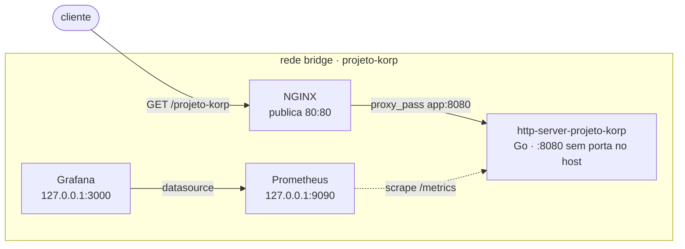

# Projeto Korp — DevOps / DevSecOps Showcase

[](https://github.com/SamuelvLopes/DevSecOps-showcase/actions/workflows/ci.yml)
[](https://github.com/SamuelvLopes/DevSecOps-showcase/actions/workflows/security.yml)

Serviço HTTP em Go atrás de NGINX, com métricas Prometheus, dashboard Grafana
provisionado por arquivo e todo o ambiente provisionado por um único comando
Ansible.

O **core do desafio** é Go + Docker + NGINX + Prometheus/Grafana + Ansible.
Release atual: **v1.2.0**. Terraform e Kubernetes são extensões opcionais e
estão validados estaticamente — não há infraestrutura cloud em execução.

## Arquitetura



A aplicação **não publica porta no host**: só é alcançável pela rede interna,
através do NGINX. Prometheus e Grafana ficam em loopback, fora da interface
pública. Detalhes e limites em [`docs/architecture.md`](docs/architecture.md).

## Requisitos do desafio

| Requisito oficial | Implementação | Evidência |
| --- | --- | --- |
| **Parte 1** — serviço Go na 8080, `GET /projeto-korp` com horário UTC por requisição, Dockerfile, rede bridge, app sem porta publicada, NGINX 80→80 com volume em `/etc/nginx/conf.d/` | [`app/`](app), [`app/Dockerfile`](app/Dockerfile), [`compose.yaml`](compose.yaml), [`nginx/http-server-projeto-korp.conf`](nginx/http-server-projeto-korp.conf) | `make compose-smoke` |
| **Parte 2** — disponibilidade e volume de requisições em padrão Prometheus, Prometheus e Grafana no Compose, dashboard do serviço | [`app/internal/metrics/`](app/internal/metrics), [`prometheus/prometheus.yml`](prometheus/prometheus.yml), [`grafana/`](grafana) | `make compose-load` |
| **Parte 3** — playbook que instala Docker, cria a rede, builda a imagem, sobe o Compose, configura NGINX e monitoramento, valida por HTTP e imprime a resposta | [`ansible/`](ansible) | `ansible-playbook site.yml` |
| **Bônus** — Grafana provisionado por arquivo em vez de configuração manual | [`grafana/provisioning/`](grafana/provisioning) | `make compose-smoke` valida datasource e dashboard por UID |

Matriz completa de requisito → arquivo → critério de aceite em
[`docs/requirements.md`](docs/requirements.md).

O dashboard vai além dos dois sinais obrigatórios e cobre RED — taxa, erros
e duração — em oito painéis. Os dois exigidos pelo enunciado continuam lá
com o nome explícito: "Disponibilidade da aplicacao" e "Volume de
requisicoes". `make compose-smoke` verifica que ambos existem e que **toda**
query do dashboard aponta para uma métrica realmente exposta pela aplicação,
para que nenhum painel possa ser publicado vazio.

## Quick start

Pré-requisitos: Docker, Docker Compose e GNU Make.

```bash
make compose-up
curl http://localhost:80/projeto-korp
```

```json
{"nome":"Projeto Korp","horario":"2026-09-09T03:40:51Z"}
```

O campo `horario` é resolvido a cada requisição, no instante da chamada, em UTC
e formato RFC3339. Duas chamadas no mesmo segundo podem legitimamente retornar
o mesmo texto.

Dashboard em <http://127.0.0.1:3000> — **acesso anônimo habilitado, sem login**.
O dashboard "Projeto Korp" já vem provisionado, com disponibilidade e volume de
requisições. Para gerar movimento nos gráficos, `make compose-load`. Ao
terminar, `make compose-down`.

### Provisionamento completo por Ansible

As partes 1 e 2 sobem inteiras com um comando, em host Linux da família Debian
(alvo: Ubuntu 24.04 LTS):

```bash
cd ansible
ansible-galaxy collection install -r requirements.yml
ansible-playbook site.yml
```

O playbook instala Docker, cria a rede bridge, copia a stack, executa o Compose
e ao final valida o endpoint HTTP, o target do Prometheus, o datasource e o
dashboard do Grafana — imprimindo a resposta de `/projeto-korp` no console.
Inventário e execução remota em [`ansible/README.md`](ansible/README.md).

## Evidências

Um comando imprime a evidência da entrega inteira:

```bash
make demo
```

Percorre contrato HTTP, portas publicadas, target do Prometheus, volume de
requisições e provisionamento do Grafana. **Derruba a stack ao final** — para
navegar no Grafana, use `make compose-up` e deixe a stack no ar.

As mesmas verificações rodam em CI a cada pull request, em jobs separados:

| Job | O que comprova |
| --- | --- |
| `Compose smoke` | contrato HTTP pelo proxy, target do Prometheus, datasource e dashboard por UID, e que a aplicação não publica porta |
| `Compose load observability` | carga curta com [k6](scripts/load-k6.js) e o contador de requisições respondendo no Prometheus |
| `Compose recovery demo` | falha injetada no serviço e recuperação, com a métrica voltando a `1` |
| `Go quality` | testes com race detector, formatação e vet |
| `Go vulnerability scan` / `Image vulnerability scan` | `govulncheck` e scan da imagem, bloqueantes |

## Engenharia além do desafio

- **Imagem mínima e sem privilégio**: build multi-stage para `scratch`, usuário
  não-root, `read_only`, `cap_drop: ALL` e `no-new-privileges`
  ([`app/Dockerfile`](app/Dockerfile), [`compose.yaml`](compose.yaml)).
- **Operabilidade**: `/health`, encerramento gracioso em SIGINT/SIGTERM,
  timeouts de servidor e logs estruturados em JSON.
- **Segurança como gate**: `govulncheck` e scan de imagem bloqueiam a PR;
  threat model STRIDE e security review versionados.
- **Observabilidade RED**: além de disponibilidade e volume, a aplicação expõe
  um histograma de duração, o que permite P50/P95/P99 e taxa de erro por classe
  de status no dashboard. O histograma agrupa por rota e método, sem status,
  para manter limitado o número de séries de bucket.
- **Teste de carga e recuperação** automatizados, não só smoke.
- **Rastreabilidade**: uma branch e uma PR por ticket, com critérios de aceite
  registrados em [`.po/`](.po/README.md) e ADRs para as decisões estruturais.
- **Validação em checkout limpo** (`make clean-checkout`), garantindo que a
  entrega não depende de estado local.

## Showcase opcional

Fora do escopo do enunciado, presentes como demonstração de amplitude:

- **Imagem publicada no GHCR** pelo workflow `Container Image`, com tag por
  branch e tag imutável `sha-<commit>`. Disponível publicamente:
  ```bash
  docker pull ghcr.io/samuelvlopes/devsecops-showcase/http-server-projeto-korp:develop
  ```
- **Helm chart e Kubernetes** — chart da aplicação e do NGINX, `ServiceMonitor`
  para o kube-prometheus-stack, valores para Loki, Tempo, Alloy e Beyla, e
  bootstrap OpenTelemetry opt-in na aplicação. Validados por `helm lint` e
  `helm template` em CI; **não há cluster em execução**.
  Ver [`docs/kubernetes-observability.md`](docs/kubernetes-observability.md).
- **Terraform para AWS e Azure** — exemplos que provisionam uma VM Ubuntu para
  uso com o playbook. Validados por `fmt` e `validate` em CI; **nunca aplicados
  em conta real**. Ver [`docs/terraform-cloud.md`](docs/terraform-cloud.md).

## Validação

Fluxo da entrega:

```bash
make compose-smoke      # HTTP, Prometheus, Grafana e portas publicadas
make compose-load       # carga curta com k6 e métrica no Prometheus
make compose-recovery   # falha injetada e recuperação do serviço
make clean-checkout     # valida a entrega em diretório temporário limpo
```

Qualidade e artefatos:

```bash
make check              # formatação, vet, testes com race detector e whitespace
make docker-build
make ansible-syntax
make helm-lint          # opcional
make terraform-validate # opcional
```

`make help` lista todos os targets. Para desenvolvimento direto da aplicação
(requer Go 1.27.1 ou superior):

```bash
cd app
go run ./cmd/http-server-projeto-korp
curl http://localhost:8080/projeto-korp
```

O endereço padrão é `:8080`; `HTTP_ADDRESS=:18080` permite outra porta em
desenvolvimento sem alterar o requisito do container.

## Endpoints

| Endpoint | Resposta |
| --- | --- |
| `GET /projeto-korp` | JSON com `nome` e `horario` UTC |
| `GET /health` | HTTP 204, sem corpo |
| `GET /metrics` | Exposição Prometheus: `projeto_korp_up` (gauge), `projeto_korp_http_requests_total` (counter) e `projeto_korp_http_request_duration_seconds` (histogram) |

## Documentação

Avaliação:

- [Requisitos e critérios de aceite](docs/requirements.md)
- [Arquitetura e limites](docs/architecture.md)
- [Roteiro de demo](docs/demo.md)
- [Technical walkthrough](docs/technical-walkthrough.md)

Operação e segurança:

- [Runbook](docs/runbook.md)
- [Threat model STRIDE](docs/threat-model.md)
- [Security review](docs/security-review.md)
- [Decisões técnicas (ADRs)](docs/decisions/ADR-001-compose-core.md)

Processo:

- [Releases](RELEASE.md)
- [GitFlow e convenções](docs/gitflow.md)
- [Governança GitHub](docs/github-governance.md)
- [Tickets e dependências](.po/README.md)
